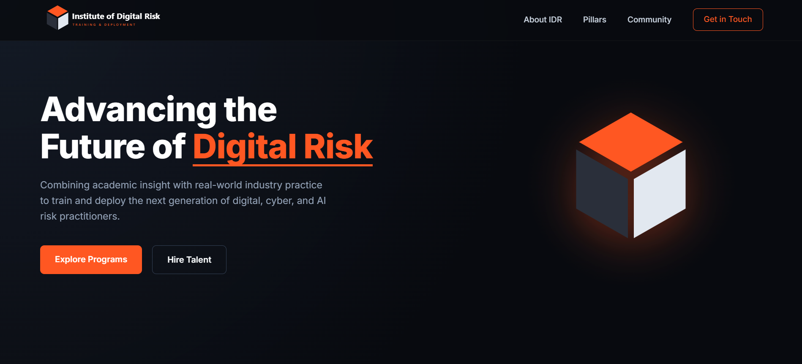
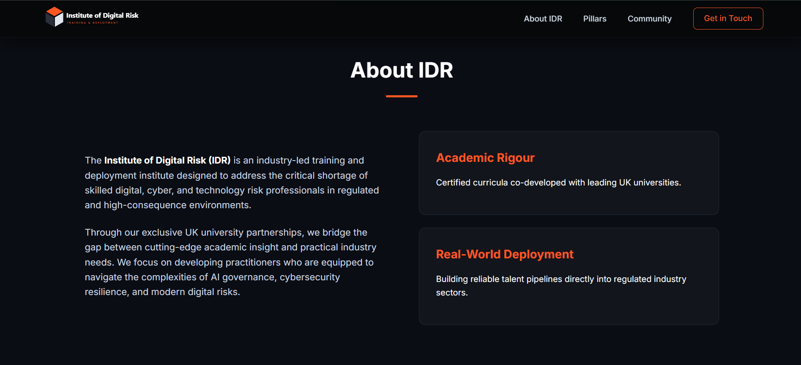
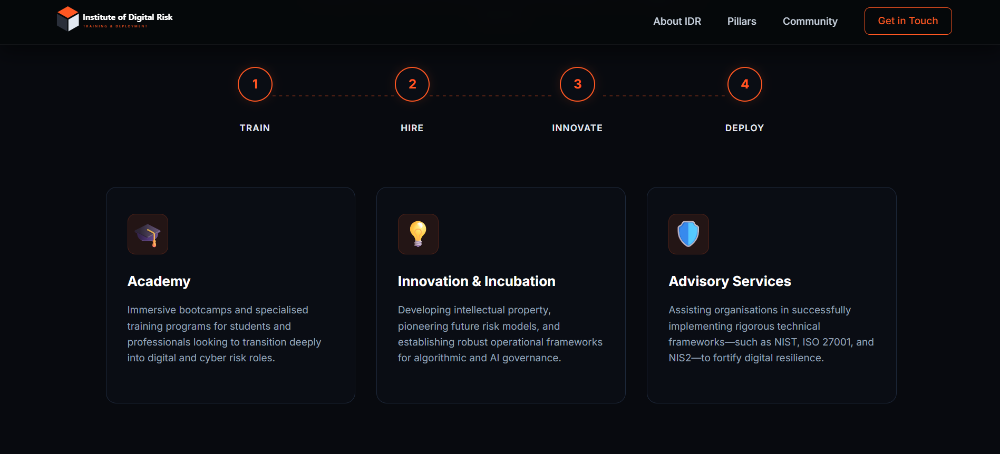
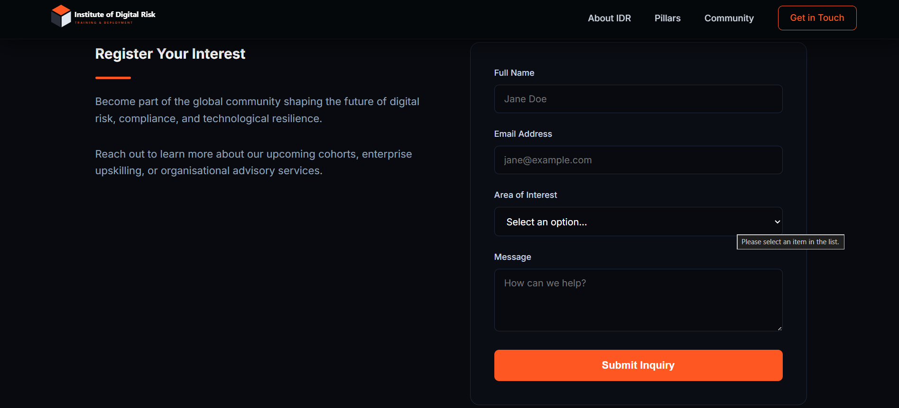

# Institute of Digital Risk (IDR) Brand & Homepage

  
   
  
   
  
   
  
   
  

This repository contains the completed branding assets and single-page, responsive website for the **Institute of Digital Risk (IDR)**.

## Deliverables Completed
1. **Logo Variants (SVG)**
   - `assets/logo-icon.svg`: The icon-only representation.
   - `assets/logo-full.svg`: The full logo including the geometric icon and "Institute of Digital Risk" typography.
2. **Homepage Build**
   - `index.html`: Semantic HTML5 structure.
   - `style.css`: Clean, vanilla CSS layout and styling without relying on heavy frameworks.
   - `script.js`: Provides vanilla JS interactivity for sticky headers, mobile navigation, and mock form submissions.

## Design Rationale & Identity Choices
- **Symbolism**: The logo features a deconstructed, geometric isometric cube. This immediately evokes concepts of "structure", "data architecture", and "layers", perfectly fitting for a technology risk and resilience institute. The separation between the cube's faces represents continuous building and agility in the face of risks.
- **Color Palette**: 
  - *Orange (#FF5A00)* serves as the primary driver; it commands attention, subtly implying caution/risk, while evoking energy and action.
  - *Black (#1A1A1A)* and *White* firmly ground the brand, lending a harsh, professional authority suitable for high-consequence sectors (like finance and critical infrastructure).
- **Typography**: The primary web font utilized is **Inter**, a clean, highly legible geometric sans-serif font. Tracking (letter-spacing) is reduced on large headers to emphasize authority, while body copy maintains comfortable leading for deep readability, ensuring the aesthetic mirrors a prestigious academic-industry institution.

## How to View
Simply open `index.html` in your web browser of choice. No build tools or dev-servers are required as this utilizes vanilla web standards.

> **Note**: For the best experience viewing the scroll behaviors and full responsiveness, resizing the browser window between desktop and mobile dimensions will trigger layout adjustments via robust CSS Grid/Flexbox constraints.
